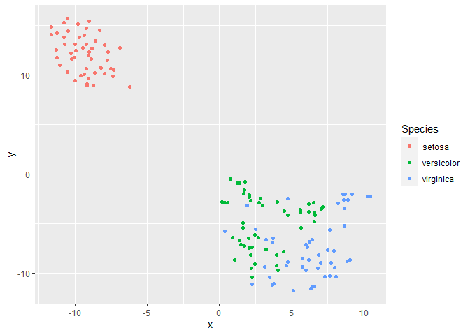

<!-- README.md is generated from README.Rmd. Please edit that file -->

# WTSNE

<!-- badges: start -->
<!-- badges: end -->

The goal of WTSNE is to …

## Installation

<!-- You can install the released version of WTSNE from [CRAN](https://CRAN.R-project.org) with: -->
<!-- ``` r -->
<!-- install.packages("WTSNE") -->
<!-- ``` -->

And the development version from [GitHub](https://github.com/) with:

``` r
# install.packages("devtools")
devtools::install_github("chenxuepu/WTSNE")
```

## Example

This is a basic example which shows you how to solve a common problem:

``` r
library(WTSNE)
library(ggplot2)
library(MASS)
## basic example code
```

``` r
iris_uni <- unique(iris)
iris_lda <- MASS::lda(Species~.,iris_uni)
iris_p <- predict(iris_lda,iris_uni)$posterior
iris_p_max <- apply(iris_p,1,max)

good_fit <- (iris_p_max > quantile(iris_p_max,0.50))
weight <- ifelse(good_fit,2,1)
set.seed(123)
iris_tsne <- WTSNE(iris_uni[,1:4],weight=weight)
y <- as.data.frame(iris_tsne$Y)
y <- cbind(y,iris_uni$Species)
names(y) <- c("x","y","Species")
ggplot(y,aes(x=x,y=y,color = Species)) +
  geom_point()
```


